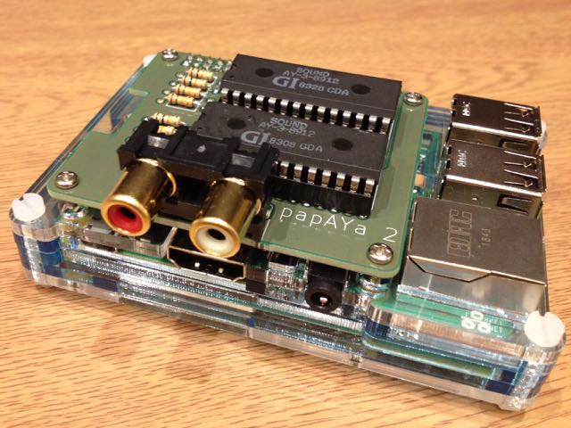
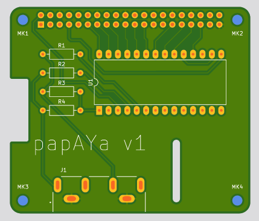
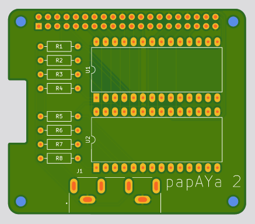

# papAYa
an AY-3-8912 sound chip expansion board for the Raspberry Pi

## Why?
[I do ZX Spectrum chiptune performances](http://gasman.zxdemo.org/), but taking an entire ZX Spectrum setup to a venue is a faff, especially at gigs where the organisers are more used to people rocking up with a Gameboy, plugging in a jack and being ready to play. Some of the tracks I play require two sound chips, and taking two Spectrums would be even more of a faff.

Sure, you can emulate it, and honestly the AY is well-understood and deterministic enough that it would make no difference to the sound. But if you take that attitude, then what's the point of live music anyhow? I figure you don't need a 1980s-vintage Spectrum to be authentic, but you do at least need the actual sound chip.

Basically, I want to be as cool as the Gameboy folks. I want to get up on stage and make magic happen from a handheld device like I'm piloting a goddamn spaceship. And the best way to do that is to hook up an AY chip (or two) to a Raspberry Pi.

## What's here

* `papaya/` - KiCad files for the single-AY board
* `papaya2/` - KiCad files for the double-AY board
* `player/` - Command-line players for .psg files (as exported by [AY Emulator](https://bulba.untergrund.net/emulator_e.htm) and [Fuse](http://fuse-emulator.sourceforge.net/)). Requires [pigpio](http://abyz.me.uk/rpi/pigpio/) to build.
  * `player/psg` - plays a single-AY track in .psg format. Run with `sudo ./psg somefile.psg`
  * `player/psg2` - plays a dual-AY track exported as two .psg files. Run with `sudo ./psg2 somefile1.psg somefile2.psg`

## Bill of materials

For the single-AY board:
* Papaya v1 PCB
* P1 - 2x20 pin GPIO header https://www.adafruit.com/product/2222
* J1 - dual RCA connector [PJRAN2X1U01AUX](https://www.mouser.co.uk/ProductDetail/Switchcraft/PJRAN2X1U01AUX?qs=mcPJWgAPNre69iQqys4MXw%3D%3D)
* U1 - AY-3-8912 sound chip (_not_ AY-3-8912A - see below)
* R1, R2 - 10k resistor
* R3, R4 - 15k resistor

For the dual-AY board:

* Papaya 2 PCB
* P1 - 2x20 pin GPIO header https://www.adafruit.com/product/2222
* J1 - dual RCA connector [PJRAN2X1U01AUX](https://www.mouser.co.uk/ProductDetail/Switchcraft/PJRAN2X1U01AUX?qs=mcPJWgAPNre69iQqys4MXw%3D%3D)
* U1, U2 - AY-3-8912 sound chip (_not_ AY-3-8912A - see below)
* R1, R2, R5, R6 - 10k resistor
* R3, R4, R7, R8 - 15k resistor

## Design considerations
The AY data bus (pins DA0-DA7) is connected directly to GPIO pins: 17, 27, 22, 10, 9, 11, 5, 6. The AY chip is a 5V device while the Raspberry Pi runs on 3.3V, but since the data direction is write-only and the AY accepts anything over 2.5V as logic high, no level conversion is needed.

For the first AY chip, BC1 is on GPIO pin 13 and BDIR is on pin 19. On the dual AY board, the second chip's BC1 is on pin 20 and BDIR is on pin 21. The clock signal is provided by the Raspberry Pi's hardware clock on GPIO pin 4.

Audio output is in ACB stereo format: channel A (of both chips) is mixed to the left, channel B to the right and C in the centre.

Note that AY-3-8912A chips (which are the majority of those available on eBay / AliExpress) do not function correctly, for as-yet-undetermined reasons; the noise generator doesn't get triggered. (See [the side-by-side comparison](https://twitter.com/gasmanic/status/1227395760758624256).) This doesn't seem to be due to the 5V / 3.3V mismatch - the same behaviour was seen on an earlier Arduino-based prototype too.

Technically this board doesn't qualify as a HAT, as it doesn't include the identifying EPROM.

## Mounting
With socketed chips, the Raspberry Pi and papAYa combo fits neatly into a [SmartiPi Touch 2 case](https://thepihut.com/products/smartipi-touch-2) with a [15mm back cover](https://thepihut.com/products/smartipi-touch-2-back-cover), provided you use [11mm spacers](https://thepihut.com/products/raspberry-pi-hat-mounting-kit) rather than the slightly-taller ones that come with the touchscreen.
